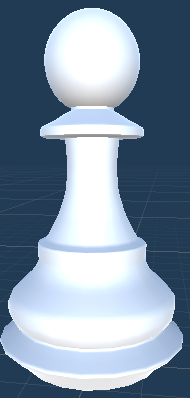
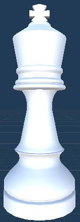

# Three Space Lab Candidate Take Home Exercise

## Personal Documentation

__Directory:__
There are 7 important script files in total:
1. Board - Assets/Scripts/Board.cs
2. Tile - Assets/Scripts/Tile.cs
3. Piece - Assets/Scripts/Piece.cs
4. Pawn - Assets/Scripts/Pawn.cs
5. Knight - Assets/Scripts/Knight.cs
6. King - Assets/Scripts/King.cs
7. Imovement - Assets/Scripts/Imovement.cs

__What each file does:__
1. Board - This is the board class, it keeps track of 'all' the tile locations on the board. It also contains the feature for the user to click and move chess piece around the board. Additional added functions include changing the players turn, moving chess pieces and ending the game.
2. Tile - This is the tile class, it contains the coordinates of a tile piece on the board. This tile class contains the information if a chess piece is on this tile and the location of this tile so that another chess piece can move to the tile position.
3. Piece - This is the piece class, it keeps track of the type/class of piece: King, Pawn, Knight, etc. By knowing what type the chess piece is we can call the MovmentCheck() function from that class. It also keeps track of what color the chess piece is.
4. Pawn - The movement check for both the attack and movement of the pawn, also based off it's color: white goes up, black goes down.
5. Knight - The movement check for the knight based off a L pattern, in 8 possible directions.
6. King - The movement check for the king based off a compass, in 8 possible directions.
7. Imovement - Holds the interface class/methods for the Pawn, Knight and King pieces.

__Steps to solving the problem__
1. Research what the question/problem is asking for? We know we have to create a chess game with specific rules.
2. What other rules and research can we do? We know there are only 8 possible directions for the King chess piece to move or attack towards, like a compass.
3. Write out the classes/methods/variables that we may possibly need.
4. Attack each problem into different subproblems. We need to figure out if a chess piece is already on a tile. We can solve this by having a boolean value that keeps track of this particular info. 
5. Reduce any repetitive code, write out the comments and write out this documentation.

__Final Notes/Thoughts:__
Personally thank you for giving me the opportunity to take this take home test, and a Unity project nonetheless. Especially with a company that’s doing similar work to my previous masters capstone project. Please note that this is the first time I’ve used classes and interfaces for a Unity project. In most of my Unity projects I usually wrote scripts that could be attached to a gameobject in the scene. 

__Notes__
* Private/public access modifiers/declaration - I absolutely wanted to avoid using any global public variables, unless they were already initialized such as the Tiles x and y coordinates. This is to practice encapsulation and to enforce the usage of setters and getters which also help readability in the future. Ex: Someone types in “_tile.isColor” compared to: “_tile.getIsColor()

* Struct classes -  Some of the classes could have as well been a struct, however those classes contain a private method, although not necessary, it keeps up with abstraction and to make my code clean and readable, where the user and others don't need to know how it works. Also the class makes it easy in my Piece class to use King king == null to be checked since null checks won't with value types (aka structs). I've also never used a struct in Unity before. 

* Inheritance - Since all the main classes are attached to a gameobject, they require the usage of MonoBehaviour which is already inheriting another class from Unity. Since C# doesn’t allow multiple inheritance it was best to avoid creating classes that needed to be inherited from the monobehaviour classes 

* Method Chaining - There were a few method chaining methods in the game. I wanted to use as few as possible, even though it makes code look readable, it can make it harder to debug, make it harder for future users to determine what the code does and it’s not really necessary (for example it might make more sense if you were adding the code to the Update() function).

* Inheritance - There were two types of inheritance used for this game. One was used for both the King and Knight pieces and the other for the pawn piece. This is because the pawn piece requires more information to be passed on such as the board and boolean movement value. The king and knight pieces although can use the same parameters for their movement, have different methods of movement: ie. knights go in a L and kings go in any compass direction.

* Avoid touching the update() - I’m glad that the rays and mouse click values were already given. This made it easier to avoid touching the update() function. It’s because the update() is called in every frame and unnecessary checks will make it cost more to run in the future, etc. I also felt that I could reduce the amount of checks needed because we technically start checking the chess pieces when we click and unclick a tile. 

* Multiple ways to complete this project - I also realized there were multiple ways to complete this project, ranging from only using all three classes that were given to me (board, tile, piece), to using keyboard inputs instead of the mouse, etc. 

## What's the point of this exercise?

The purpose of this exercise is for you to demonstrate your __code design and implementation skills__ in the context of a toy Unity project.

__Things we are looking for:__

* Completion of all listed [__requirements__](#requirements)
* __Intentional code.__ We want to see that you think about the context and requirements of a specific problem and make _intentional decisions_ about how to structure your code for that problem. 
* We'll be reading your code with a focus on the following aspects:
  * __Clean and readable code style:__ Is it easy to understand what the code is doing?
  * __Separation of concerns:__ Does your code separate unrelated things, and group related things together?
  * __Encapsulation:__ Do you structure your code in a way that attempts to _prevent invalid use_?
  * __Don't repeat yourself:__ Do you factor out shared behavior into appropriate constructs and abstractions (functions, classes, MonoBehaviours, interfaces, etc)?
  * __Use language and engine constructs appropriately:__
    * When and why do you choose to use a struct vs. a plain C# class vs. a `MonoBehaviour`? 
    * When and why do you choose to use polymorphism, interfaces, events, etc.
  * __Consistency:__ Are you consistent about these choices across your solution?
  * __Performance:__ Do you take steps to reduce unnecessary work and allocations?

__Things we are _NOT_ looking for:__

  * We are __not__ looking for a polished user experience. Nice user interactions are super important for real apps, but they take a long time! We don't want you to spend a lot of time on things we won't be judging you on, and __we're really focused on your code__, so only add extra nice things if you've fulfilled all the requirements, you're happy with your code, and you still feel like you want to spend more time on it.
  * We are __not__ looking for perfection, or a right answer. We don't think there's one right solution or one right code style or anything like that, and we're not looking for code that looks exactly like ours. The thing we care most about is that you can pay attention to the context and demands of a __specific problem__ and make __intentional decisions__ about how to structure + design your code to solve that problem.
  
### Thank you!

Before you get started in earnest, we want to thank you very much for taking the time to complete this exercise! We know there are plenty of other companies you could be (and probably are) spending your time applying to, so we deeply appreciate your interest in us, and we thank you for your effort. We will follow up with you as soon as possible after submission!

## The Game

The toy project we're asking you to implement is based on Chess. Our simplified version of Chess has the following rules:

* Each player takes turns making 1 single move at a time.
* The player controlling the white pieces will go first.
* The game ends when a player captures the opposing player's King (There is no check or checkmate in this simplified version of Chess).
* A piece is captured when a piece controlled by the opposing player is moved onto the same square as the piece being captured. The captured piece is removed from play.
* Each piece has different rules for how it may move, enumerated below:

### Pawn

* A pawn moves straight forward (towards the other team's side of the board) one square, if that square is vacant. If it has not yet moved, a pawn also has the option of moving two squares straight forward, provided both squares are vacant. Pawns cannot move backwards.
* A pawn, unlike other pieces, captures differently from how it moves. A pawn can capture an enemy piece on either of the two squares diagonally in front of the pawn (but cannot move to those squares if they are vacant). 

### Knight

* A knight moves to the nearest square not on the same rank, file, or diagonal. (This can be thought of as moving two squares horizontally then one square vertically, or moving one square horizontally then two squares vertically—i.e. in an "L" pattern.) The knight is not blocked by other pieces: it jumps to the new location.

### King 

* A king moves 1 square in any direction: horizontally, vertically, or diagonally.

## What you are provided

* Unity Project that contains a Chess board with pieces already on the board. 
* A `Board` component that finds and manages references to all the tiles on it, and publishes events for tiles that are clicked or hovered with the mouse cursor.
* A `Tile` component that contains its position.
* A `Piece` component that contains its position.

## Requirements

### Game Requirements

* Only allow movement of the pieces for the player whose turn it is.
* Implement the movement rules for all 3 pieces.
* Captured pieces are removed from the board.
* Do not allow any more movements to take place after the game end condition has been met.

### Implementation Requirements

* Usage of _any_ C# or Unity events. These could be either the events provided in the `Board` class or any other events you deem appropriate.